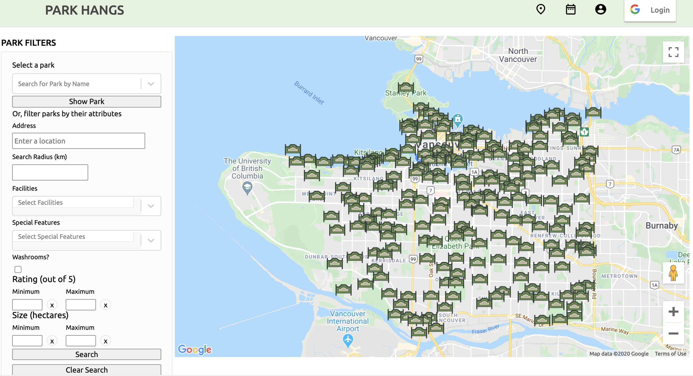
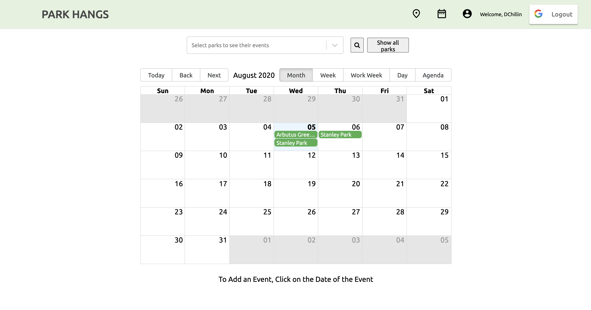
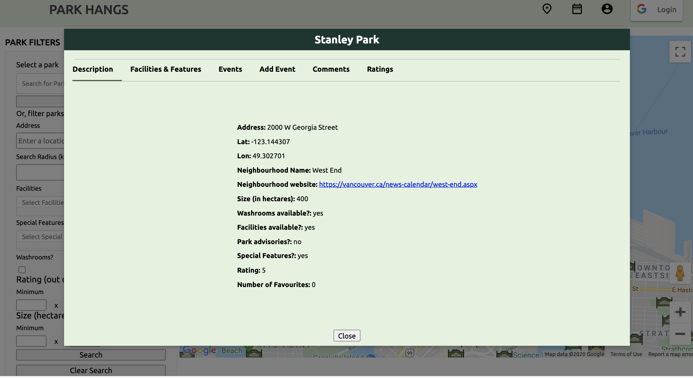
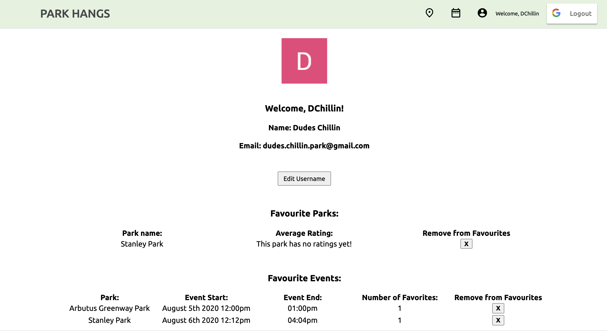

# ParkHangs

ParkHangs is an all-in-one platform that allows users interact with all official Vancouver, British Columbia Parks. Users can get detailed information about a specific park, save favourite parks (if they are logged in), create and integrate events to their own calendar application, as well as write comments about parks and events.

**CPSC 436i Group Project**

**Who is it for?**

Our web application is intended for people who want to enjoy the Vancouver public park system. For people who want to organize a pickup game of basketball, check what facilities are available so they can plan before they go, see which parks are rated the best, and see what other users have to say about the park. Our application is available to both signed-in and non signed-in users.

**What will it do?** (What "human activity" will it support?)

This platform will allow users to organize meetups at Vancouver parks, write comments about parks/events, filter parks by fields, determine the closest parks to them, or to a place they want to go, and make information about a park easily accessible.

**What type of data will it store?**

All 216 Vancouver parks and their information, user-generated events, park and event comments. We also store user information (through OAuth-based Google Sign-in) such as their name and email.

**What will users be able to do with this data?**

View information about a particular park, view events that other users make at parks, create new events, write comments about a park or an event, and filter parks by information like parks near a certain address, what facilities are at a park, etc).

**What is some additional functionality you can add/remove based on time constraints?**

One stretch goal is to make the web application responsive to mobile and desktop users. Another stretch goal is to update park information occasionally using a cron job in case information about park changes and our app will be able to show the latest details about a park.

**Project task requirements:**

**3-5 minimal requirements (will definitely complete)**

- [x] Make simple park Vancouver Parks information available to users (park address, if a park has facilities, size of park etc)
- [x] Display all parks on Google Maps
- [x] Create/view all/delete/update an event at a park
- [x] Find events by entering a park name (or any part of a park name)

**3-7 "standard" requirements (will most likely complete)**
- [x] Incorporate special feature and facilities information to parks by using additional Vancouver Open Data Portal APIs
- [x] Filter parks by fields such as rating, park size, facilities, special features
- [x] Share events from parks to Google calendars
- [x] Find parks by address
- [x] Use OAuth-based Google Sign-in to allow users to create an account and save events and parks to their account
- [x] Allows users to add events to their calendar application (Apple, Google etc) (originally we included only Google calendar integration but we added more calendar applications)
- [x] Allow both non-logged-in users and users to add comments to both events and parks, as well as add ratings to parks

**2-3 stretch requirements (plan to complete 1!)**
- [x] Make the application mobile-friendly (responsive)
- [ ] Allow users to invite other users within the app
- [ ] Make the app only useable with an account, make the account secure (We decided to allow both users with accounts and users without accounts, see standard requirements regarding OAuth-based Google Sign-in)
- [ ] Create a cron job that re-populates the park database weekly or monthly to ensure that all the park information is up to date

**Pick 2 of your minimal requirements and break each of them down into ~2-5 smaller tasks!**
- Create tables in our own database to represent a park and an event
- Create a script to get all of the parks data from the Vancouver parks API and then write them into our database (so we don’t have to do it by hand)

## Course technologies used

All the technologies that we learned in this course are utilized in our project:

**HTML/CSS/JavaScript**

We utilized HTML/CSS throughout our application (with React) for displaying/styling components, views.
JavaScript was used in the frontend and backend to write methods such as for display logic, manipulate objects etc.

**React/Redux** 

React was used to create all the components that we used in our application. We used Redux Toolkit for state management.
  
**Node.js/Express.js**

We used these two for building the backend. Our frontend interacts with 
the endpoints and the backend interacts with the database. Database operations (GET/POST/DELETE/PATCH) are supported 
depending on the collection.

**MongoDB** 

We included Mongoose as well. We used MongoDB Atlas as our backend cloud database storage of information. 
We had collections including parks, users, events, park comments, and event comments.

**Release Engineering**

We deployed our application using Heroku.

## Above and Beyond

We integrated a calendar package and customized it to allow for better visual representation for ease of scheduling events, 
as well as improved User Experience through interactivity. By incorporating OAuth-based Google Sign-in, 
we provide a simple way for users sign-in without registration and the ability for users to view a clear overview of their personal saved parks and events. 

We incorporated a feature to allow for the events in the application to be exported to other commonly used calendars such as Google calendar, and we believe this adds an extra level of practicality for users to remember the event.  
In addition, the use of Redux-Toolkit allows our code to ‘mutate’ immutable update logic in an organized slice of state, as well as include commonly used Redux addons such as Redux Thunk for effective code writing.

The filter park functionality is also one of the features we are most proud of for this project. This filter enables users to filter parks on the map by features, as well as the ability to find parks by address and around a certain radius. A lot of work went into this feature and this gives an extra layer of practicality to our application.

## Next Steps

- Work on the 3 stretch goals that we stated. 
- As our application only has Vancouver park information, determine if other near by cities 
have readily available park information and integrate this to the application
- Organizing events at parks depends heavily on weather conditions so we would like to integrate weather information 

## List of Contributions

Lydia Zheng:
- Export functionality to Google calendar (as well as other calendar applications)
- Made custom icons and adjustments to rating buttons
- Developed and tested to ensure modals in app are web responsive.
- Frontend styling development (especially with cleaning up styling issues are were present in the early stages of development)

Gordon Zhang:

- Set up schemas with Mongoose for parks and events models
- Set up of MongoDB Atlas and connection to the backend
- Implemented OAuth-based Google Sign-in in the application to include signed-in users and developed 
frontend/backend functionality for users
- Ensure local storage in browser stores redux data so refreshing page persists user information

Claire Anderson
- Came up with the original concept for the project
- Implemented the modal system, routing, and the calendar page in the front end
- Completed the end-to-end implementation of filtering parks by parameters as well as their location, 
and the editing and deleting of events

Philippe Chapdelaine

- Worked on front-end and all the endpoints(fetch, add delete) for comments and ratings
- Fetch and add endpoints for events 
- Set up the Google maps npm package and well as create Google/MongoDB accounts

## Sketches of Main Functionality

**Main Functionality**
**Map Page With Filter**

**Calendar Page**

**Park Features**

**User Profile Page**

